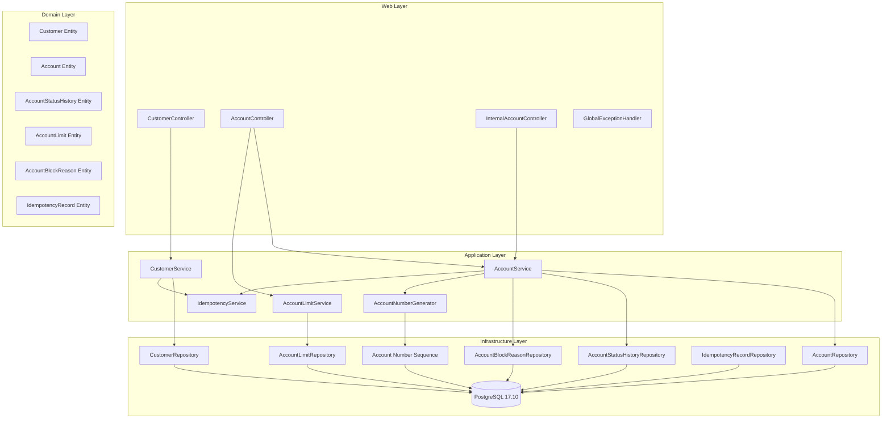

# Customer Account Service — Design

**Spec**: `.specs/features/customer-account-service/spec.md`
**Status**: Draft

---

## Architecture Overview

Standard Spring Boot layered architecture with DDD-inspired package structure. Four layers — domain, application, infrastructure, web — with strict dependency direction: web → application → domain ← infrastructure. No infrastructure concerns leak into domain.



---

## Code Reuse Analysis

### Existing Components to Leverage

| Component | Location | How to Use |
| --- | --- | --- |
| None | — | This is the first service implementation; no existing code to reuse |

### Integration Points

| System | Integration Method |
| --- | --- |
| PostgreSQL 17.10 | Spring Data JPA + Flyway migrations |
| payment-orchestrator (future) | Internal REST endpoint (GET /api/v1/internal/accounts/{id}/validate) |
| ledger-service (future) | No direct dependency; ledger references accounts by UUID only |

---

## Components

### Web Layer — `com.watabank.customeraccount.web`

#### CustomerController

- **Purpose**: Expose customer creation and retrieval REST endpoints
- **Location**: `src/main/java/com/watabank/customeraccount/web/CustomerController.java`
- **Endpoints**:
  - `POST /api/v1/customers` — create customer (idempotent via X-Idempotency-Key)
  - `GET /api/v1/customers/{customerId}` — get customer with account summaries
- **Dependencies**: CustomerService
- **Reuses**: N/A (first service)

#### AccountController

- **Purpose**: Expose account creation, lifecycle transitions, and limit management
- **Location**: `src/main/java/com/watabank/customeraccount/web/AccountController.java`
- **Endpoints**:
  - `POST /api/v1/customers/{customerId}/accounts` — create account (idempotent)
  - `GET /api/v1/accounts/{accountId}` — get account with limits, block reasons, history
  - `POST /api/v1/accounts/{accountId}/activate` — activate account (idempotent)
  - `POST /api/v1/accounts/{accountId}/block` — block account (idempotent)
  - `POST /api/v1/accounts/{accountId}/unblock` — unblock account (idempotent)
  - `POST /api/v1/accounts/{accountId}/close` — close account (idempotent)
  - `GET /api/v1/accounts/{accountId}/limits` — list limits
  - `POST /api/v1/accounts/{accountId}/limits` — create limit (idempotent)
  - `PUT /api/v1/accounts/{accountId}/limits/{limitId}` — update limit
  - `DELETE /api/v1/accounts/{accountId}/limits/{limitId}` — delete limit
- **Dependencies**: AccountService, AccountLimitService
- **Reuses**: N/A (first service)

#### InternalAccountController

- **Purpose**: Expose internal service-to-service validation endpoint (no auth)
- **Location**: `src/main/java/com/watabank/customeraccount/web/InternalAccountController.java`
- **Endpoints**:
  - `GET /api/v1/internal/accounts/{accountId}/validate` — validate account eligibility
- **Dependencies**: AccountService
- **Reuses**: N/A (first service)

#### GlobalExceptionHandler

- **Purpose**: Centralized exception-to-HTTP-response mapping
- **Location**: `src/main/java/com/watabank/customeraccount/web/GlobalExceptionHandler.java`
- **Interfaces**: `@RestControllerAdvice` with `@ExceptionHandler` methods for:
  - `MethodArgumentNotValidException` → 400
  - `InvalidTransitionException` → 400
  - `AccountNotFoundException` → 404
  - `CustomerNotFoundException` → 404
  - `DuplicateEmailException` → 409
  - `IdempotencyMismatchException` → 422
  - `IllegalArgumentException` (malformed UUID) → 400
  - `Exception` (unexpected) → 500
- **Dependencies**: None (Spring-provided types)
- **Reuses**: N/A

#### DTOs — `com.watabank.customeraccount.web.dto`

| DTO | Purpose |
| --- | --- |
| `CreateCustomerRequest` | `@NotBlank firstName`, `@NotBlank lastName`, `@NotBlank @Email email` |
| `CustomerResponse` | `id`, `firstName`, `lastName`, `email`, `createdAt`, `accounts: List<AccountSummaryDto>` |
| `AccountSummaryDto` | `id`, `accountNumber`, `status`, `currency` |
| `CreateAccountRequest` | `@NotBlank @Pattern(ISO4217) currency`, `Optional<String> accountNumber` |
| `AccountResponse` | `id`, `customerId`, `accountNumber`, `status`, `currency`, `createdAt`, `updatedAt`, `limits: List<LimitDto>`, `activeBlockReasons: List<BlockReasonDto>`, `recentHistory: List<StatusHistoryDto>` |
| `BlockAccountRequest` | `@NotNull @ValidBlockReason reason` |
| `CloseAccountRequest` | `@NotBlank reason` |
| `CreateLimitRequest` | `@NotNull limitType`, `@Positive BigDecimal amount`, `@NotBlank @Pattern(ISO4217) currency` |
| `UpdateLimitRequest` | `@Positive BigDecimal amount`, `@Pattern(ISO4217) currency` |
| `LimitDto` | `id`, `limitType`, `amount`, `currency` |
| `BlockReasonDto` | `id`, `reason`, `blockedAt` |
| `StatusHistoryDto` | `id`, `previousStatus`, `newStatus`, `reason`, `changedAt`, `changedBy` |
| `ValidationResponse` | `valid: boolean`, `accountId`, `status`, `reasons: List<String>` |
| `ErrorResponse` | `status`, `error`, `message`, `timestamp`, `correlationId` |
| `IdempotencyRequired` | Marker annotation for controllers to trigger idempotency check |

---

### Application Layer — `com.watabank.customeraccount.application`

#### CustomerService

- **Purpose**: Customer creation with email uniqueness check, idempotency support, and retrieval with account summaries
- **Location**: `src/main/java/com/watabank/customeraccount/application/CustomerService.java`
- **Interfaces**:
  - `createCustomer(CreateCustomerRequest req, String idempotencyKey): CustomerResponse`
  - `getCustomer(UUID customerId): CustomerResponse`
- **Dependencies**: CustomerRepository, IdempotencyService, AccountRepository (for summaries)
- **Reuses**: N/A

#### AccountService

- **Purpose**: Account lifecycle management with state machine validation, audit trail recording, and default limit creation
- **Location**: `src/main/java/com/watabank/customeraccount/application/AccountService.java`
- **Interfaces**:
  - `createAccount(UUID customerId, CreateAccountRequest req, String idempotencyKey): AccountResponse`
  - `getAccount(UUID accountId): AccountResponse`
  - `activateAccount(UUID accountId, String idempotencyKey): AccountResponse`
  - `blockAccount(UUID accountId, BlockAccountRequest req, String idempotencyKey): AccountResponse`
  - `unblockAccount(UUID accountId, String idempotencyKey): AccountResponse`
  - `closeAccount(UUID accountId, CloseAccountRequest req, String idempotencyKey): AccountResponse`
  - `validateAccount(UUID accountId): ValidationResponse`
- **Dependencies**: AccountRepository, CustomerRepository, AccountStatusHistoryRepository, AccountBlockReasonRepository, AccountLimitRepository, AccountNumberGenerator, IdempotencyService
- **Reuses**: N/A

#### AccountLimitService

- **Purpose**: Account limit CRUD with idempotency support
- **Location**: `src/main/java/com/watabank/customeraccount/application/AccountLimitService.java`
- **Interfaces**:
  - `getLimits(UUID accountId): List<LimitDto>`
  - `createLimit(UUID accountId, CreateLimitRequest req, String idempotencyKey): LimitDto`
  - `updateLimit(UUID accountId, UUID limitId, UpdateLimitRequest req): LimitDto`
  - `deleteLimit(UUID accountId, UUID limitId): void`
- **Dependencies**: AccountLimitRepository, AccountRepository, IdempotencyService
- **Reuses**: N/A

#### AccountNumberGenerator

- **Purpose**: Generate unique 10-digit sequential account numbers using PostgreSQL sequence
- **Location**: `src/main/java/com/watabank/customeraccount/application/AccountNumberGenerator.java`
- **Interfaces**:
  - `generate(): String` — returns zero-padded 10-digit string (e.g. "0000000001")
- **Dependencies**: JdbcTemplate (for sequence NEXTVAL query)
- **Reuses**: N/A

#### IdempotencyService

- **Purpose**: Idempotency key check-and-record in a single atomic operation
- **Location**: `src/main/java/com/watabank/customeraccount/application/IdempotencyService.java`
- **Interfaces**:
  - `checkAndRecord(String idempotencyKey): Optional<String>` — returns cached response body if key exists, null if new key (proceed with operation)
  - `storeResponse(String idempotencyKey, String responseBody): void` — store successful response for future duplicate requests
  - `storeError(String idempotencyKey, String errorBody): void` — store error response for future duplicate requests
- **Dependencies**: IdempotencyRecordRepository
- **Reuses**: N/A

---

### Domain Layer — `com.watabank.customeraccount.domain`

#### Customer

- **Purpose**: JPA entity representing a bank customer
- **Location**: `src/main/java/com/watabank/customeraccount/domain/Customer.java`
- **Fields**: `id` (UUID, PK), `firstName` (String, not null), `lastName` (String, not null), `email` (String, unique, not null), `createdAt` (Instant, not null)
- **Dependencies**: None
- **Reuses**: N/A

#### Account

- **Purpose**: JPA entity representing a financial account with optimistic locking for concurrent status transitions
- **Location**: `src/main/java/com/watabank/customeraccount/domain/Account.java`
- **Fields**: `id` (UUID, PK), `customerId` (UUID, FK → Customer), `accountNumber` (String, unique, not null), `status` (AccountStatus, not null), `currency` (String, not null), `createdAt` (Instant, not null), `updatedAt` (Instant, not null), `version` (Long, @Version)
- **Dependencies**: Customer (FK relationship via customerId)
- **Reuses**: N/A

#### AccountStatus (Enum)

- **Purpose**: Enum defining valid account states
- **Location**: `src/main/java/com/watabank/customeraccount/domain/AccountStatus.java`
- **Values**: `PENDING`, `ACTIVE`, `BLOCKED`, `CLOSED`

#### AccountStatusHistory

- **Purpose**: Immutable audit trail of account status transitions
- **Location**: `src/main/java/com/watabank/customeraccount/domain/AccountStatusHistory.java`
- **Fields**: `id` (UUID, PK), `accountId` (UUID, FK → Account), `previousStatus` (AccountStatus, nullable — null for first transition), `newStatus` (AccountStatus, not null), `reason` (String, not null), `changedAt` (Instant, not null), `changedBy` (String, default "SYSTEM")
- **Dependencies**: Account (FK relationship)
- **Reuses**: N/A

#### AccountLimit

- **Purpose**: JPA entity for per-account limits
- **Location**: `src/main/java/com/watabank/customeraccount/domain/AccountLimit.java`
- **Fields**: `id` (UUID, PK), `accountId` (UUID, FK → Account), `limitType` (LimitType, not null), `amount` (BigDecimal, not null), `currency` (String, not null)
- **Dependencies**: Account (FK relationship), LimitType (enum)
- **Reuses**: N/A

#### LimitType (Enum)

- **Purpose**: Enum defining limit categories
- **Location**: `src/main/java/com/watabank/customeraccount/domain/LimitType.java`
- **Values**: `TRANSACTION`, `DAILY`, `MONTHLY`

#### AccountBlockReason

- **Purpose**: JPA entity recording block reasons with unblock timestamp
- **Location**: `src/main/java/com/watabank/customeraccount/domain/AccountBlockReason.java`
- **Fields**: `id` (UUID, PK), `accountId` (UUID, FK → Account), `reason` (String, not null), `blockedAt` (Instant, not null), `unblockedAt` (Instant, nullable)
- **Dependencies**: Account (FK relationship)
- **Reuses**: N/A

#### IdempotencyRecord

- **Purpose**: JPA entity storing idempotency key → response mapping
- **Location**: `src/main/java/com/watabank/customeraccount/domain/IdempotencyRecord.java`
- **Fields**: `id` (UUID, PK), `idempotencyKey` (String, unique, not null), `responseBody` (String/text, not null), `statusCode` (Integer, not null), `createdAt` (Instant, not null)
- **Dependencies**: None
- **Reuses**: N/A

---

### Infrastructure Layer — `com.watabank.customeraccount.infrastructure.persistence`

#### CustomerRepository

- **Purpose**: Spring Data JPA repository for Customer
- **Location**: `src/main/java/com/watabank/customeraccount/infrastructure/persistence/CustomerRepository.java`
- **Interfaces**: `findByEmail(String email): Optional<Customer>`
- **Dependencies**: Spring Data JPA

#### AccountRepository

- **Purpose**: Spring Data JPA repository for Account
- **Location**: `src/main/java/com/watabank/customeraccount/infrastructure/persistence/AccountRepository.java`
- **Interfaces**: `findByCustomerId(UUID customerId): List<Account>` (for customer summaries), `findByAccountNumber(String accountNumber): Optional<Account>`
- **Dependencies**: Spring Data JPA

#### AccountStatusHistoryRepository

- **Purpose**: Spring Data JPA repository for AccountStatusHistory
- **Location**: `src/main/java/com/watabank/customeraccount/infrastructure/persistence/AccountStatusHistoryRepository.java`
- **Interfaces**: `findTop10ByAccountIdOrderByChangedAtDesc(UUID accountId): List<AccountStatusHistory>`
- **Dependencies**: Spring Data JPA

#### AccountLimitRepository

- **Purpose**: Spring Data JPA repository for AccountLimit
- **Location**: `src/main/java/com/watabank/customeraccount/infrastructure/persistence/AccountLimitRepository.java`
- **Interfaces**: `findByAccountId(UUID accountId): List<AccountLimit>`
- **Dependencies**: Spring Data JPA

#### AccountBlockReasonRepository

- **Purpose**: Spring Data JPA repository for AccountBlockReason
- **Location**: `src/main/java/com/watabank/customeraccount/infrastructure/persistence/AccountBlockReasonRepository.java`
- **Interfaces**: `findByAccountIdAndUnblockedAtIsNull(UUID accountId): List<AccountBlockReason>` (active blocks)
- **Dependencies**: Spring Data JPA

#### IdempotencyRecordRepository

- **Purpose**: Spring Data JPA repository for IdempotencyRecord
- **Location**: `src/main/java/com/watabank/customeraccount/infrastructure/persistence/IdempotencyRecordRepository.java`
- **Interfaces**: `findByIdempotencyKey(String key): Optional<IdempotencyRecord>`
- **Dependencies**: Spring Data JPA

---

## Data Models

### Database Schema

#### Table: `customers`

| Column | Type | Constraints |
| --- | --- | --- |
| `id` | UUID | PK |
| `first_name` | VARCHAR(255) | NOT NULL |
| `last_name` | VARCHAR(255) | NOT NULL |
| `email` | VARCHAR(255) | NOT NULL, UNIQUE |
| `created_at` | TIMESTAMPTZ | NOT NULL |

#### Table: `accounts`

| Column | Type | Constraints |
| --- | --- | --- |
| `id` | UUID | PK |
| `customer_id` | UUID | NOT NULL, FK → customers(id) |
| `account_number` | VARCHAR(20) | NOT NULL, UNIQUE |
| `status` | VARCHAR(20) | NOT NULL |
| `currency` | VARCHAR(3) | NOT NULL |
| `created_at` | TIMESTAMPTZ | NOT NULL |
| `updated_at` | TIMESTAMPTZ | NOT NULL |
| `version` | BIGINT | NOT NULL, DEFAULT 0 |

#### Table: `account_status_history`

| Column | Type | Constraints |
| --- | --- | --- |
| `id` | UUID | PK |
| `account_id` | UUID | NOT NULL, FK → accounts(id) |
| `previous_status` | VARCHAR(20) | NULL (null for first-ever transition) |
| `new_status` | VARCHAR(20) | NOT NULL |
| `reason` | VARCHAR(255) | NOT NULL |
| `changed_at` | TIMESTAMPTZ | NOT NULL |
| `changed_by` | VARCHAR(100) | NOT NULL, DEFAULT 'SYSTEM' |

#### Table: `account_limits`

| Column | Type | Constraints |
| --- | --- | --- |
| `id` | UUID | PK |
| `account_id` | UUID | NOT NULL, FK → accounts(id) |
| `limit_type` | VARCHAR(20) | NOT NULL |
| `amount` | DECIMAL(19,2) | NOT NULL |
| `currency` | VARCHAR(3) | NOT NULL |

#### Table: `account_block_reasons`

| Column | Type | Constraints |
| --- | --- | --- |
| `id` | UUID | PK |
| `account_id` | UUID | NOT NULL, FK → accounts(id) |
| `reason` | VARCHAR(50) | NOT NULL |
| `blocked_at` | TIMESTAMPTZ | NOT NULL |
| `unblocked_at` | TIMESTAMPTZ | NULL |

#### Table: `idempotency_records`

| Column | Type | Constraints |
| --- | --- | --- |
| `id` | UUID | PK |
| `idempotency_key` | VARCHAR(255) | NOT NULL, UNIQUE |
| `response_body` | TEXT | NOT NULL |
| `status_code` | INTEGER | NOT NULL |
| `created_at` | TIMESTAMPTZ | NOT NULL |

#### Sequence: `account_number_seq`

- `START 1` — database-managed, safe for concurrent access via NEXTVAL

### Entity Relationships

```
Customer (1:N) Account          — via customer_id FK
Account  (1:N) AccountStatusHistory — via account_id FK
Account  (1:N) AccountLimit         — via account_id FK
Account  (1:N) AccountBlockReason   — via account_id FK
IdempotencyRecord (standalone)      — no FK to domain entities
```

---

## State Machine Rules

```
PENDING  ──[activate]──► ACTIVE
ACTIVE   ──[block]─────► BLOCKED
ACTIVE   ──[close]─────► CLOSED
BLOCKED  ──[unblock]───► ACTIVE
BLOCKED  ──[close]─────► CLOSED
PENDING  ──[close]─────► CLOSED
CLOSED   ──[any op]────► 400 (no transitions from terminal)
```

Implementation: `AccountService` validates each transition before updating. Each successful transition records an `AccountStatusHistory` row. Optimistic locking (`@Version`) prevents lost-update races during concurrent status changes.

---

## Idempotency Flow

```
Request with X-Idempotency-Key arrives
  │
  ▼
IdempotencyService.checkAndRecord(key)
  │
  ├── Key not found: store placeholder → proceed with business logic
  │       │
  │       ▼
  │   Business logic succeeds
  │       │
  │       ▼
  │   IdempotencyService.storeResponse(key, responseBody)
  │       │
  │       ▼
  │   Return response
  │
  └── Key found: return cached responseBody with stored statusCode
```

Atomicity: `checkAndRecord` uses `INSERT ... ON CONFLICT DO NOTHING` semantics via Spring Data's `save` wrapped in a transaction. If the key already exists, the duplicate request gets the cached response.

---

## Error Handling Strategy

| Error Scenario | Exception Type | HTTP Status | Response |
| --- | --- | --- | --- |
| Missing/invalid fields in request | `MethodArgumentNotValidException` | 400 | ErrorResponse with field-level details |
| Invalid account status transition | `InvalidTransitionException` (custom) | 400 | ErrorResponse with current status and allowed transitions |
| Account not found | `AccountNotFoundException` (custom) | 404 | ErrorResponse |
| Customer not found | `CustomerNotFoundException` (custom) | 404 | ErrorResponse |
| Duplicate email | `DuplicateEmailException` (custom) | 409 | ErrorResponse |
| Idempotency key reused with different body | `IdempotencyMismatchException` (custom) | 422 | ErrorResponse |
| Malformed UUID in path | `IllegalArgumentException` (Spring type conversion) | 400 | ErrorResponse |
| Database constraint violation | `DataIntegrityViolationException` | 409 or 500 | ErrorResponse |
| Optimistic lock failure | `ObjectOptimisticLockingFailureException` | 409 | ErrorResponse with retry guidance |
| Unexpected errors | `Exception` | 500 | ErrorResponse (sanitized, no stack trace in body) |

Error response format:
```json
{
  "status": 400,
  "error": "Bad Request",
  "message": "Account status must be PENDING to activate, current status: ACTIVE",
  "timestamp": "2026-06-25T10:30:00Z",
  "correlationId": "a1b2c3d4-e5f6-7890-abcd-ef1234567890"
}
```

---

## Flyway Migration Plan

| Version | File | Creates |
| --- | --- | --- |
| V1 | `V1__create_customers.sql` | `customers` table |
| V2 | `V2__create_accounts.sql` | `accounts` table + `account_number_seq` sequence |
| V3 | `V3__create_account_status_history.sql` | `account_status_history` table |
| V4 | `V4__create_account_limits.sql` | `account_limits` table |
| V5 | `V5__create_account_block_reasons.sql` | `account_block_reasons` table |
| V6 | `V6__create_idempotency_records.sql` | `idempotency_records` table |

Migrations live in `src/main/resources/db/migration/`.

---

## Gradle Build Structure

### Root `settings.gradle.kts`
```kotlin
rootProject.name = "wata-bank"
include("services:customer-account-service")
```

### Root `build.gradle.kts`
Configure allprojects with:
- Java 21 toolchain
- Spotless (Google Java Format)
- SpotBugs
- Test dependencies: JUnit 5, AssertJ, Mockito
- Testcontainers BOM

### Service `build.gradle.kts`
```kotlin
plugins {
    java
    id("org.springframework.boot") version "3.5.11"
    id("io.spring.dependency-management") version "1.1.7"
}
dependencies {
    spring-boot-starter-web
    spring-boot-starter-data-jpa
    spring-boot-starter-validation
    spring-boot-starter-actuator
    flyway-core, flyway-database-postgresql
    postgresql
    micrometer-registry-prometheus
    lombok (annotationProcessor)
    test: spring-boot-starter-test, testcontainers, testcontainers-postgresql
}
```

---

## Application Configuration

`application.yml`:
```yaml
server.port: 8081
spring:
  application.name: customer-account-service
  datasource:
    url: jdbc:postgresql://localhost:5432/watabank
    username: watabank
    password: watabank
  jpa:
    hibernate.ddl-auto: validate
    open-in-view: false
  flyway.enabled: true
management:
  endpoints.web.exposure.include: health,prometheus
  metrics.export.prometheus.enabled: true
logging:
  pattern.level: "%5p [%X{correlationId}]"
```

---

## Risks & Concerns

| Concern | Location | Impact | Mitigation |
| --- | --- | --- | --- |
| No existing project build | Root `build.gradle.kts` | Build failures block all implementation | Build configuration is T1 — implemented first, verified with `./gradlew build` before any service code |
| Account number sequence not reset-safe | DB sequence | Dropping dev DB loses sequence count | Sequence starts at 1 and only increments; gaps are acceptable — documented as known behavior |
| Optimistic locking may cause user-facing 409 | `Account.java` | Concurrent status transitions may fail | 409 returned to caller with retry guidance; this is correct behavior for concurrent operations |
| Idempotency records grow unbounded | `idempotency_records` table | Long-running system accumulates records | Not addressed in MVP — TTL/deletion is a future concern; acceptable for portfolio demo |
| No authentication on internal endpoints | `InternalAccountController` | Any service on network can call validate | By design per spec — internal endpoints are trusted-network only; add auth in a separate feature |

---

## Tech Decisions

| Decision | Choice | Rationale |
| --- | --- | --- |
| Database sequence for account numbers | PostgreSQL `CREATE SEQUENCE` with `NEXTVAL` via JdbcTemplate | Atomic, concurrent-safe, deterministic — simpler than UUID-based or random generation |
| Optimistic locking for concurrent transitions | JPA `@Version` on Account entity | Prevents lost-update races during status changes; standard Spring pattern |
| Idempotency via separate table | `idempotency_records` table with unique constraint on key | Simple, works without distributed cache; check-and-set is a single INSERT that fails on duplicate |
| Lenient JSON parsing | Jackson `FAIL_ON_UNKNOWN_PROPERTIES = false` | Ignoring extra fields is the Spring Boot default and avoids breaking clients that send unknown fields |
| Default limits created in application layer | `AccountService.createAccount()` calls `AccountLimitRepository.saveAll()` | Defaults are business logic, not schema concerns; co-located with account creation for transactional consistency |
| Bean validation on DTOs only | javax.validation annotations on `*Request` DTOs, not entities | Standard Spring practice; validation at the API boundary before business logic |
| Custom ISO 4217 currency validation | `@Pattern` regex on 3-letter currency codes + `@Currency` custom validator | Lightweight for MVP; full ISO 4217 list can be added later |
